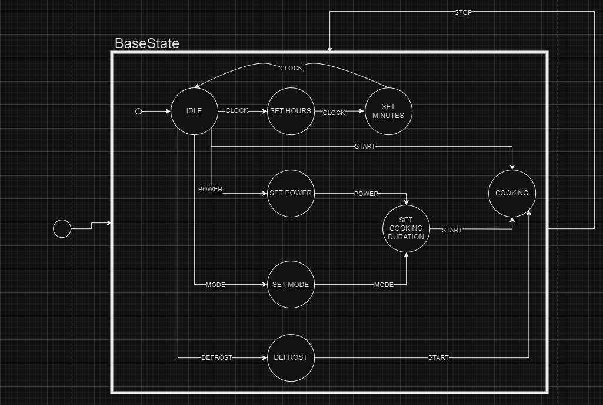
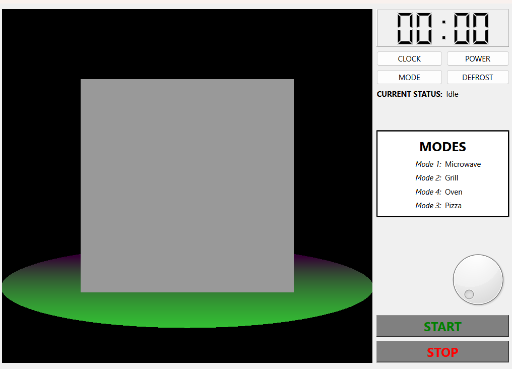

# QT_StateChart

> This project is a simple UI interface made with QT Statecharts.

## About this project

This project was made to better understand the implementation of states into an intuitive UI we can see everyday such as a microwave.
I also implemented a quick openGL render to illustrate the inside of the microwave with QOpenGLWidget. 

## How to install the project

To install the project:
1. Clone this repository on your local machine
2. Install QT on your machine
3. Open the project containing the .pro file
4. Launch the project and it should render without any problems!

